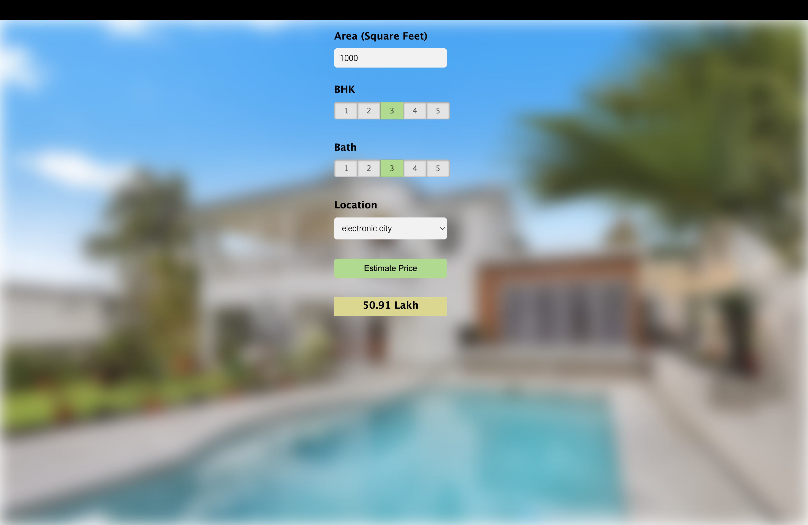

# Real Estate Price Prediction Web App

This project focuses on building a web application that predicts real estate prices based on input features such as square feet, number of bedrooms, bathrooms, and other property details. The application uses a machine learning model trained on the **Bangalore home prices dataset** from Kaggle. It includes a backend developed with Python and Flask that serves predictions through HTTP requests, and a frontend built using HTML, CSS, and JavaScript for user interaction.
## Project Components

The project is broken down into three main steps:

1. **Model Building**:
   - [Use the **Bangalore home prices dataset** from Kaggle.](https://www.kaggle.com/datasets/rachitchourasia/bangaluru-house-price-data/data)
   - Preprocess the data by cleaning, handling outliers, and performing feature engineering.
   - Build a **linear regression model** using **scikit-learn**.
   - Optimize the model using techniques like **GridSearchCV** and **k-fold cross-validation**.
   - Save the trained model for use in the Flask server.

2. **Flask API**:
   - Develop a **Python Flask server** that loads the trained model and serves predictions based on input features.
   - The API receives house-related features (e.g., area in square feet, number of bedrooms, number of bathrooms) via HTTP requests and returns the predicted price.

3. **Web Interface**:
   - Create a simple web interface using **HTML**, **CSS**, and **JavaScript**.
   - The user can input house features like area, bedrooms, bathrooms, etc.
   - The web page sends a request to the Flask server and displays the predicted price.

## Technology Stack

- **Python**: The core programming language for model building and backend.
- **Numpy** & **Pandas**: For data cleaning and preprocessing.
- **Matplotlib**: For data visualization during exploratory data analysis.
- **Scikit-learn (sklearn)**: For building and evaluating the machine learning model.
- **Flask**: For building the backend web server to handle requests.
- **HTML/CSS/JavaScript**: For building the frontend user interface.
- **Jupyter Notebook**: For model development and experimentation.
- **Visual Studio Code/PyCharm**: As IDEs for code development.

## Data Science Concepts Covered

- **Data Loading and Cleaning**: Handling missing values, renaming columns, encoding categorical variables.
- **Outlier Detection and Removal**: Identifying and removing outliers to improve model performance.
- **Feature Engineering**: Creating new features to enhance the model.
- **Dimensionality Reduction**: Reducing the number of features to focus on the most important ones.
- **Model Building**: Training a linear regression model to predict house prices.
- **Cross-validation**: Using k-fold cross-validation to evaluate model performance.
- **Hyperparameter Tuning**: Applying GridSearchCV to find the best model parameters.

### User Interface

